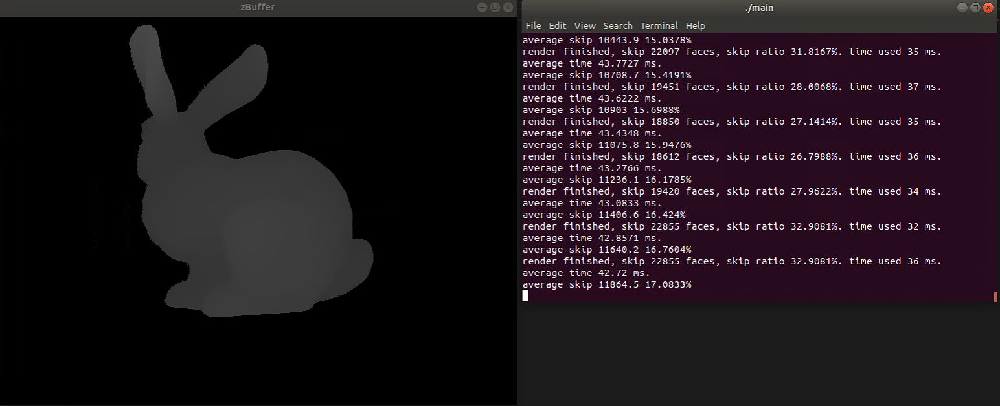
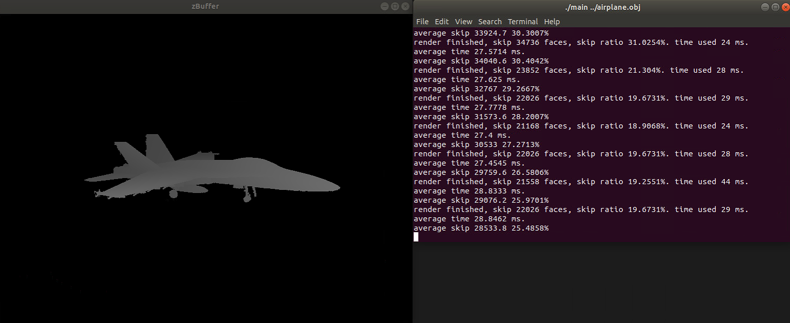
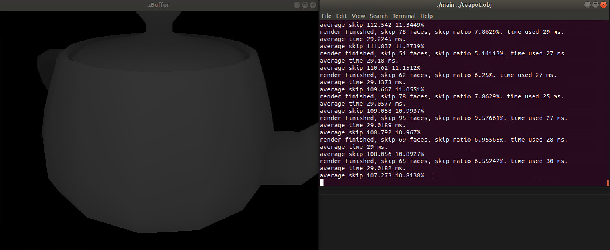
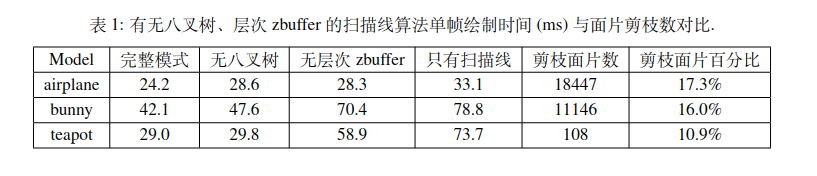

# Hierarchical_zBuffer
## Environment
```
Ubuntu 18.04
CMake 3.18.4
C++ 7.5.0
freeglut 2.8.1 (for display)
```
## Complile project
```bash
cd $ROOT
mkdir build
cmake ..
make
```
## Render
```bash
cd build
./main $PATH_TO_OBJECT
```

## Experiment
### Bunny
<div align=center>

</div>

### Airplane
<div align=center>

</div>

### Teapot
<div align=center>

</div>

### Comparsion
<div align=center>

</div>
